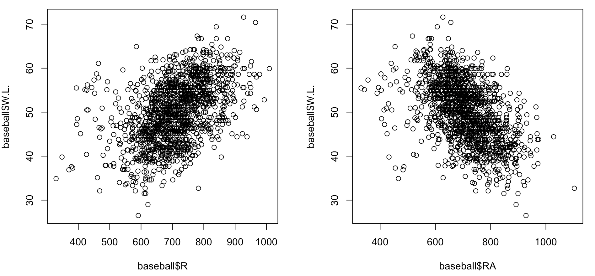
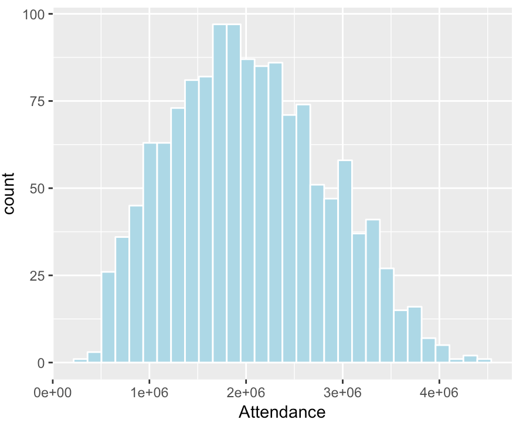
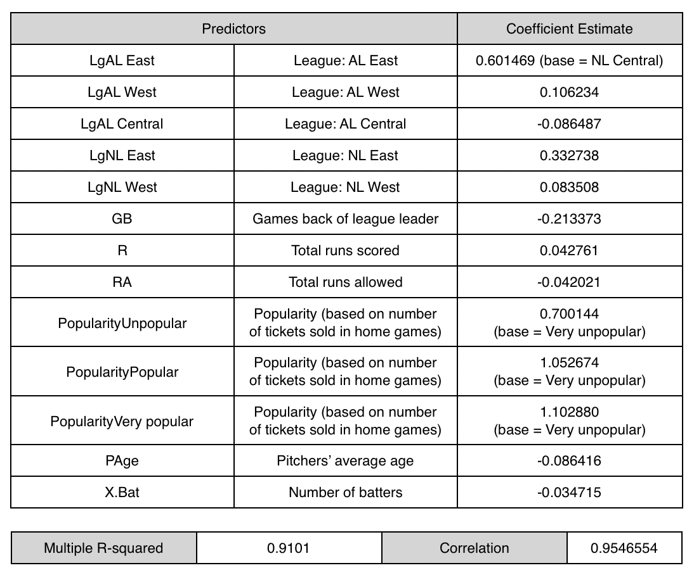

# Shiny App - Predicting Winning Rate for MLB Teams

## Table of Contents
1. [Introduction](README.md#Introduction)
2. [Deployment](README.md#Deployment)
3. [Data Cleaning and Exploratory Data Analysis](README.md#data-cleaning-and-exploratory-data-analysis)
4. [Feature Engineering](README.md#feature-engineering)
5. [Modeling](README.md#Modeling)
6. [Conclusions](README.md#Conclusions)

## Introduction
This app was developed based on the data about MLB teams and their game statistics . In this project we attempt to model the team features and performance of 30 active MLB teams during 1969-2018 seasons and predict the winning rate of a certain team in a baseball game. The data is collected by webscraping the data from baseball reference website at this <a href="https://www.baseball-reference.com/teams/">link</a>. This webscraping process is done by using the `rvest` package in R. Finally, the model is deployed as an Shiny App hosted on shinyapps.io. 

## Deployment
There are two ways to access this app.

**1. Locally, in terminal, git clone this repo to the directory of your choice:**

`$ git clone https://github.com/Anson-bling/stat418-final-project.git`

**or download zip file to the same directory. Then change your working directory to `docker` and run:**

`R -e "shiny::runApp('app/')"`

**Copy the outputting link to any browser to run this app.** 

**2. Simply access this Shiny app at https://mysticcc.shinyapps.io/Predicting_Winning_Rate_for_MLB_Teams/**

After opening this app, you can adjust the sliders and radio buttons to provide desired inputs for league, games back of league leader, runs scored, runs allowed, popularity based on tickets sold in home games, pitchers' average age, and number of batters used in game to get a prediction of the winning rate (in percentage) of your desired team. 

## Data Cleaning and Exploratory Data Analysis
We first need to clean our data. Before 1969, the 30 teams in MLB were divided into leagues in a different way from present. To make our analysis more consistent, we will only use data from 1969 to 2018. The variable GB represents the number of games back of league leader. It thus has NAs for those leader teams. We need to replace these NAs with 0s.

Then we can proceed with some exploratory data analysis.

The scatterplot of runs scored and runs allowed

We can see that there is a positive relationship between runs scored and the winning rate and a negative relationship between runs allowed and the winning rate, so we may consider adding these variables into our model.

Also, we note that the batters' average age as well as the pitchers' average age seem to be normally distributed. 

Thus we can add these two variables into our model without doing further transformations.

## Feature Engineering

Our outcome in this project is the winning rate in decimal form. Thus to make the resulted coefficients nicer and easier to interpret, we multiple this rate by 100 to get the winning rate in percentage form.

Also, we notice that the variable Attendance which is the number of tickets sold in home games has very large values compared to other numeric variables, meaning the resulted coefficient can be quite small and hard to interpret. Therefore, we create a new variable by sorting Attendance into 4 categories. The cutoff points are determined based on the histogram of the variable Attendance, as shown below. The resulted variable `Popularity` has 4 levels: `Very unpopular`, `Unpopular`, `Popular`, and `Very popular`.

  

## Modeling
We can now fit a multiple linear regression model. We start with the full model and then remove the insignificant predictors to get our final model. The result of the final model are shown in the table below.

  

This model explains more than 91% of the variations in the winning rate of these teams. Through cross validation, we can see that the correlation between the predicted winning rate and the true winning rate is about 0.95, which is quite high.

## Conclusions
Overall, our multiplt linear regression model seems to be a good fit for our data. One major limitation to this analysis is that it only employs a multiple linear regression model. To further improve the model performance, we may try some other modeling approaches such as random forest, xgboost, etc. Besides, there might exist some multicollinearity. We may also need some further exploration to avoid this problem and thus to make better predictions. 
